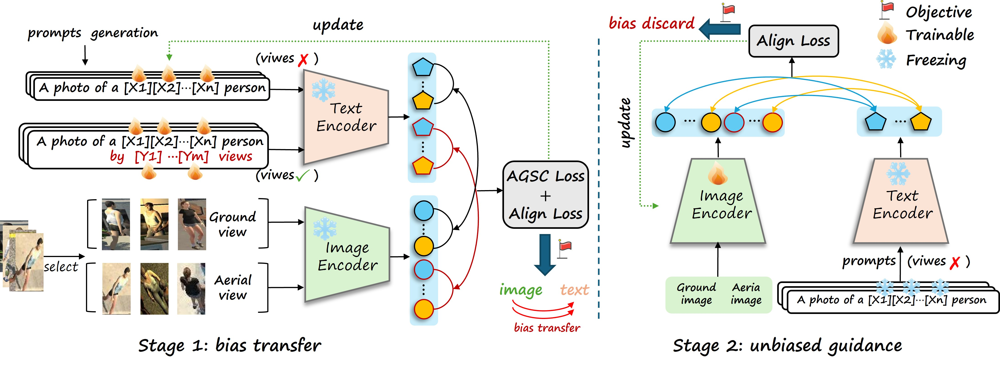

##  MVP: Mapping View-bias with Prompts for Aerial-Ground Person Re-identification
### Pipeline



### Installation

```
conda create -n mvp python=3.8
conda activate mvp
conda install pytorch==1.8.0 torchvision==0.9.0 torchaudio==0.8.0 cudatoolkit=10.2 -c pytorch
pip install yacs
pip install timm
pip install scikit-image
pip install tqdm
pip install ftfy
pip install regex
```

### Prepare Dataset

Download the datasets (CARGO、AG-reid), and then unzip them to `your_dataset_dir`.

### Training

For example, if you want to run ViT-based CLIP-ReID-baseline for the CARGO, you need to modify the bottom of configs/person/vit_clipreid.yml to

```
DATASETS:
   NAMES: ('cargo')
   ROOT_DIR: ('your_dataset_dir')
OUTPUT_DIR: 'your_output_dir'
```

### Evaluation

For example, if you want to test ViT-based CLIP-ReID for CARGO

```
CUDA_VISIBLE_DEVICES=0 python test_clipreid.py --config_file configs/person/vit_clipreid.yml TEST.WEIGHT 'your_trained_checkpoints_path/ViT-B-16_60.pth'
```

### Acknowledgement

Codebase from [TransReID](https://github.com/damo-cv/TransReID), [CLIP](https://github.com/openai/CLIP), CLIP-Reid, and [CoOp](https://github.com/KaiyangZhou/CoOp).


Note that all results listed above are without re-ranking.

With re-ranking, MVP achieves 65.7% mAP and  70.2% R1 on CARGO.
### Citation

If you use this code for your research, please cite

```

```

